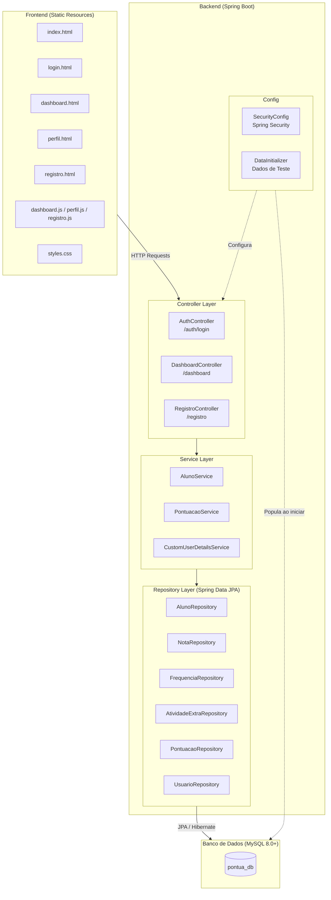
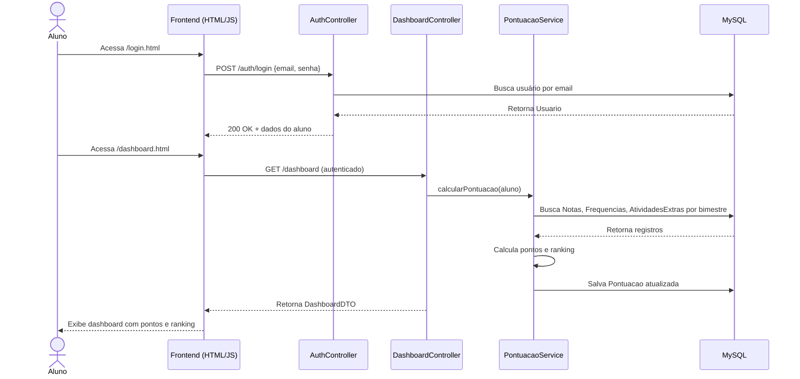

# Diagrama de Arquitetura — Pontua+

## Visão Geral das Camadas



---

## Fluxo de Requisição



---

## Organização dos Pacotes

```
com.pontuaplus.pontua_plus/
│
├── config/
│   ├── SecurityConfig.java       → Configuração do Spring Security
│   └── DataInitializer.java      → Carga inicial de dados de teste
│
├── controller/
│   ├── AuthController.java       → POST /auth/login
│   ├── DashboardController.java  → GET /dashboard
│   └── RegistroController.java   → POST /registro
│
├── dto/
│   ├── AlunoDTO.java
│   ├── DashboardDTO.java
│   └── RegistroAlunoDTO.java
│
├── entity/
│   ├── Usuario.java              → Entidade base (herança JOINED)
│   ├── Aluno.java                → Estende Usuario
│   ├── Nota.java
│   ├── Frequencia.java
│   ├── AtividadeExtra.java
│   └── Pontuacao.java
│
├── enums/
│   ├── Ranking.java              → BRONZE | PRATA | OURO | DIAMOND
│   ├── TipoAtividade.java        → Tipos de atividades extracurriculares
│   └── TipoUsuario.java          → ALUNO | PROFESSOR | ADMIN
│
├── repository/
│   ├── AlunoRepository.java
│   ├── NotaRepository.java
│   ├── FrequenciaRepository.java
│   ├── AtividadeExtraRepository.java
│   ├── PontuacaoRepository.java
│   └── UsuarioRepository.java
│
└── service/
    ├── AlunoService.java
    ├── PontuacaoService.java
    └── CustomUserDetailsService.java
```

---

## Stack Tecnológica

| Camada          | Tecnologia                      | Versão     |
|-----------------|---------------------------------|------------|
| Linguagem       | Java                            | 17         |
| Framework       | Spring Boot                     | 3.5.6      |
| Segurança       | Spring Security                 | —          |
| ORM             | Spring Data JPA + Hibernate     | —          |
| Banco de Dados  | MySQL                           | 8.0+       |
| Build           | Maven (com Maven Wrapper)       | —          |
| Utilitários     | Lombok, Spring Validation       | —          |
| Frontend        | HTML5, CSS3, JavaScript (ES6+)  | —          |
| Servidor        | Embedded Tomcat (Spring Boot)   | —          |
