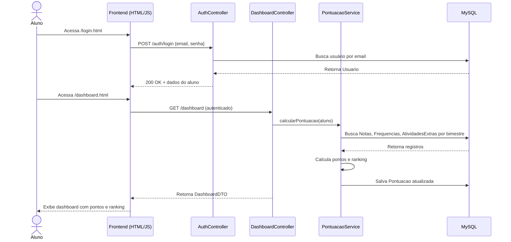

# Diagrama de Arquitetura — Pontua+

## Visão Geral das Camadas

```mermaid
flowchart TD
    subgraph Frontend["Frontend (Static Resources)"]
        direction LR
        A1[index.html]
        A2[login.html]
        A3[dashboard.html]
        A4[perfil.html]
        A5[ranking.html]
        A6[recompensas.html]
        A7[registro.html]
        A8[dashboard.js / ranking.js / recompensas.js / perfil.js / registro.js]
        A8[styles.css]
    end

    subgraph Backend["Backend (Spring Boot)"]
        direction TB

        subgraph Controllers["Controller Layer"]
            C1[AuthController\n/api/auth]
            C2[DashboardController\n/api/dashboard]
            C3[RankingController\n/api/ranking]
            C4[RecompensaController\n/api/recompensas]
            C5[RegistroController\n/api/registro]
            C6[ColaboradorAuthController\n/api/colaborador]
            C7[ResponsavelAuthController\n/api/responsavel]
            C8[AdmController\n/api/adm]
            C9[DiretorController\n/api/diretor]
            C10[EventosController\n/api/eventos]
            C11[DevController\n/api/dev]
            C12[RegistroResponsavelController\n/api/registro/responsavel]
        end

        subgraph Services["Service Layer"]
            S1[AlunoService]
            S2[PontuacaoService]
            S3[DashboardService]
            S4[RecompensaService]
            S5[ColaboradorService]
            S6[CustomUserDetailsService]
            S7[EventosService]
            S8[ResponsavelService]
        end

        subgraph Repositories["Repository Layer (Spring Data JPA)"]
            R1[AlunoRepository]
            R2[NotaRepository]
            R3[FrequenciaRepository]
            R4[AtividadeExtraRepository]
            R5[PontuacaoRepository]
            R6[UsuarioRepository]
            R7[RecompensaRepository]
            R8[EmblemaDigitalRepository]
            R9[ResponsavelRepository]
            R10[ColaboradorRepository]
        end

        subgraph Config["Config"]
            CF1[SecurityConfig\nSpring Security]
            CF2[DataInitializer\nDados de Teste]
        end
    end

    subgraph DB["Banco de Dados (MySQL 8.0+)"]
        direction LR
        D1[(pontua_db)]
    end

    Frontend -->|HTTP Requests| Controllers
    Controllers --> Services
    Services --> Repositories
    Repositories -->|JPA / Hibernate| DB
    Config -.->|Configura| Controllers
    Config -.->|Popula ao iniciar| DB
```



---

## Fluxo de Requisição



---

## Organização dos Pacotes

```
com.pontuaplus.pontua_plus/
│
├── config/
│   ├── SecurityConfig.java       → Configuração do Spring Security
│   └── DataInitializer.java      → Carga inicial de dados de teste
│
├── controller/
│   ├── AuthController.java                → GET /api/auth/me (alunos)
│   ├── DashboardController.java           → GET /api/dashboard
│   ├── RankingController.java             → GET /api/ranking
│   ├── RecompensaController.java          → GET /api/recompensas, GET /api/recompensas/emblemas
│   ├── RegistroController.java            → POST /api/registro
│   ├── RegistroColaboradorController.java → POST /api/registro/colaborador
│   ├── RegistroResponsavelController.java → POST /api/registro/responsavel
│   ├── ColaboradorAuthController.java     → GET /api/colaborador/me
│   ├── ResponsavelAuthController.java     → GET /api/responsavel/me, GET /api/responsavel/filhos, POST /api/responsavel/vincular
│   ├── AdmController.java                 → GET /api/adm/dashboard
│   ├── DiretorController.java             → GET /api/diretor/dashboard
│   ├── EventosController.java             → GET /api/eventos, GET /api/eventos/tipos, POST /api/eventos/submeter
│   └── DevController.java                 → GET /api/dev/stats
│
├── dto/
│   ├── AlunoDTO.java             → inclui bimestreAtual
│   ├── AlunoResumoDTO.java
│   ├── AdmDashboardDTO.java
│   ├── DiretorDashboardDTO.java
│   ├── DevStatsDTO.java
│   ├── DashboardDTO.java
│   ├── RankingDTO.java
│   ├── RecompensaDTO.java
│   ├── RegistroAlunoDTO.java
│   ├── RegistroResponsavelDTO.java
│   ├── SubmeterAtividadeDTO.java
│   ├── TipoAtividadeDTO.java
│   ├── AtividadeExtraDetalhadaDTO.java
│   └── VincularAlunoDTO.java
│
├── entity/
│   ├── Usuario.java              → Entidade base (herança JOINED)
│   ├── Aluno.java                → Estende Usuario
│   ├── Colaborador.java          → Estende Usuario (PROFESSOR, ADMINISTRADOR, DIRETOR, DEV, COORDENADOR)
│   ├── Responsavel.java          → Estende Usuario
│   ├── Nota.java
│   ├── Frequencia.java
│   ├── AtividadeExtra.java
│   ├── Pontuacao.java
│   ├── Recompensa.java           → Catálogo de recompensas por tier
│   └── EmblemaDigital.java       → Emblema conquistado por aluno/bimestre
│
├── enums/
│   ├── Ranking.java              → BRONZE | PRATA | OURO | DIAMOND
│   ├── TipoAtividade.java        → Tipos de atividades extracurriculares
│   └── TipoUsuario.java          → ALUNO | RESPONSAVEL | PROFESSOR | ADMINISTRADOR | COORDENADOR | DIRETOR | DEV
│
├── repository/
│   ├── AlunoRepository.java
│   ├── NotaRepository.java
│   ├── FrequenciaRepository.java
│   ├── AtividadeExtraRepository.java
│   ├── PontuacaoRepository.java
│   ├── RecompensaRepository.java
│   ├── EmblemaDigitalRepository.java
│   ├── UsuarioRepository.java
│   ├── ColaboradorRepository.java
│   └── ResponsavelRepository.java
│
└── service/
    ├── AlunoService.java
    ├── ColaboradorService.java
    ├── ResponsavelService.java
    ├── DashboardService.java
    ├── PontuacaoService.java
    ├── RecompensaService.java
    ├── EventosService.java
    └── CustomUserDetailsService.java
```

---

## Stack Tecnológica

| Camada          | Tecnologia                      | Versão     |
|-----------------|---------------------------------|------------|
| Linguagem       | Java                            | 21         |
| Framework       | Spring Boot                     | 3.5.6      |
| Segurança       | Spring Security                 | —          |
| ORM             | Spring Data JPA + Hibernate     | —          |
| Banco de Dados  | MySQL                           | 8.0+       |
| Build           | Maven (com Maven Wrapper)       | —          |
| Utilitários     | Lombok, Spring Validation       | —          |
| Frontend        | HTML5, CSS3, JavaScript (ES6+)  | —          |
| Servidor        | Embedded Tomcat (Spring Boot)   | —          |
