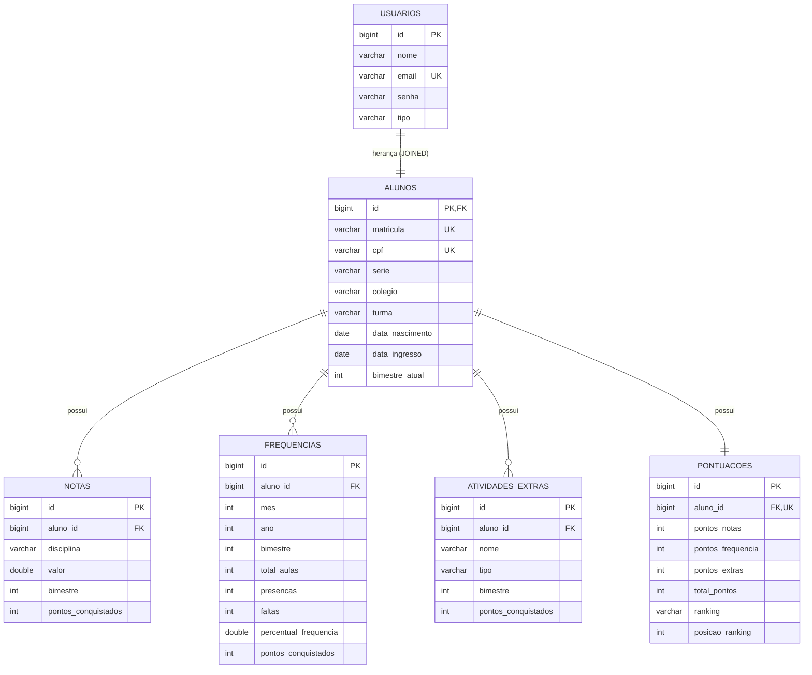

# Diagrama ER — Pontua+

## Diagrama Entidade-Relacionamento

---

## Descrição das Tabelas

### `usuarios`
Tabela base da herança. Armazena dados comuns a todos os tipos de usuário.

| Coluna  | Tipo        | Restrições       | Descrição                        |
|---------|-------------|------------------|----------------------------------|
| id      | BIGINT      | PK, Auto         | Identificador único              |
| nome    | VARCHAR     | NOT NULL         | Nome completo                    |
| email   | VARCHAR     | NOT NULL, UNIQUE | E-mail de login                  |
| senha   | VARCHAR     | NOT NULL         | Senha (criptografada)            |
| tipo    | VARCHAR     | NOT NULL         | Enum: ALUNO, PROFESSOR, ADMIN    |

---

### `alunos`
Estende `usuarios` com dados específicos do aluno (estratégia JOINED).

| Coluna          | Tipo    | Restrições       | Descrição                        |
|-----------------|---------|------------------|----------------------------------|
| id              | BIGINT  | PK, FK→usuarios  | Referência à tabela base         |
| matricula       | VARCHAR | NOT NULL, UNIQUE | Matrícula escolar                |
| cpf             | VARCHAR | NOT NULL, UNIQUE | CPF do aluno                     |
| serie           | VARCHAR | NOT NULL         | Série/ano escolar                |
| colegio         | VARCHAR | NOT NULL         | Nome da escola                   |
| turma           | VARCHAR | —                | Identificador da turma           |
| data_nascimento | DATE    | —                | Data de nascimento               |
| data_ingresso   | DATE    | —                | Data de entrada na escola        |
| bimestre_atual  | INT     | default: 2       | Bimestre ativo para cálculos     |

---

### `notas`
Notas por disciplina e bimestre de cada aluno.

| Coluna               | Tipo    | Restrições       | Descrição                        |
|----------------------|---------|------------------|----------------------------------|
| id                   | BIGINT  | PK, Auto         | Identificador único              |
| aluno_id             | BIGINT  | FK→alunos        | Aluno dono da nota               |
| disciplina           | VARCHAR | NOT NULL         | Nome da disciplina               |
| valor                | DOUBLE  | 0.0 – 10.0       | Nota obtida                      |
| bimestre             | INT     | 1 – 4            | Bimestre da nota                 |
| pontos_conquistados  | INT     | —                | Pontos calculados automaticamente |

---

### `frequencias`
Frequência mensal do aluno por bimestre.

| Coluna                | Tipo    | Restrições | Descrição                          |
|-----------------------|---------|------------|------------------------------------|
| id                    | BIGINT  | PK, Auto   | Identificador único                |
| aluno_id              | BIGINT  | FK→alunos  | Aluno referenciado                 |
| mes                   | INT     | 1 – 12     | Mês do registro                    |
| ano                   | INT     | NOT NULL   | Ano do registro                    |
| bimestre              | INT     | 1 – 4      | Bimestre do registro               |
| total_aulas           | INT     | NOT NULL   | Total de aulas no mês              |
| presencas             | INT     | NOT NULL   | Quantidade de presenças            |
| faltas                | INT     | NOT NULL   | Quantidade de faltas               |
| percentual_frequencia | DOUBLE  | —          | Calculado: (presenças/total) × 100 |
| pontos_conquistados   | INT     | —          | Pontos calculados automaticamente  |

---

### `atividades_extras`
Atividades extracurriculares realizadas pelo aluno.

| Coluna              | Tipo    | Restrições | Descrição                         |
|---------------------|---------|------------|-----------------------------------|
| id                  | BIGINT  | PK, Auto   | Identificador único               |
| aluno_id            | BIGINT  | FK→alunos  | Aluno referenciado                |
| nome                | VARCHAR | NOT NULL   | Nome da atividade                 |
| tipo                | VARCHAR | NOT NULL   | Enum: TipoAtividade               |
| bimestre            | INT     | 1 – 4      | Bimestre da atividade             |
| pontos_conquistados | INT     | —          | Pontos do tipo de atividade       |

**Tipos de atividade e pontos:**

| TipoAtividade            | Pontos |
|--------------------------|--------|
| LIDER_DE_TURMA           | 10     |
| SISTEMA_DE_COMPANHEIROS  | 10     |
| OBMEP                    | 5      |
| OLIMPIADA_MATEMATICA     | 5      |
| OUTRAS_OLIMPIADAS        | 5      |
| CLUBE_ROBOTICA           | 10     |
| CLUBE_DEBATE             | 10     |
| CLUBE_CIENCIAS           | 10     |
| CONTEUDO_AUDIO           | 15     |
| CONTEUDO_VIDEO           | 15     |
| CONTEUDO_ESCRITO         | 10     |
| VOLUNTARIADO             | 10     |

---

### `pontuacoes`
Agregação dos pontos do aluno por bimestre atual. Atualizada automaticamente.

| Coluna            | Tipo    | Restrições      | Descrição                                  |
|-------------------|---------|-----------------|--------------------------------------------|
| id                | BIGINT  | PK, Auto        | Identificador único                        |
| aluno_id          | BIGINT  | FK→alunos, UNIQUE | Aluno referenciado (1:1)                 |
| pontos_notas      | INT     | default: 0      | Pontos de notas (máx. 35)                 |
| pontos_frequencia | INT     | default: 0      | Pontos de frequência (máx. 15)            |
| pontos_extras     | INT     | default: 0      | Pontos de atividades extras (máx. 50)     |
| total_pontos      | INT     | default: 0      | Soma dos três pilares (máx. 100)          |
| ranking           | VARCHAR | NOT NULL        | Enum: BRONZE, PRATA, OURO, DIAMOND        |
| posicao_ranking   | INT     | —               | Posição no ranking geral                  |

---

## Relacionamentos

| Relação                          | Tipo    | Descrição                                               |
|----------------------------------|---------|---------------------------------------------------------|
| `usuarios` → `alunos`            | 1:1     | Herança JOINED — aluno estende usuário                  |
| `alunos` → `notas`               | 1:N     | Um aluno tem várias notas                               |
| `alunos` → `frequencias`         | 1:N     | Um aluno tem vários registros de frequência             |
| `alunos` → `atividades_extras`   | 1:N     | Um aluno participa de várias atividades                 |
| `alunos` → `pontuacoes`          | 1:1     | Um aluno tem exatamente uma pontuação consolidada       |
